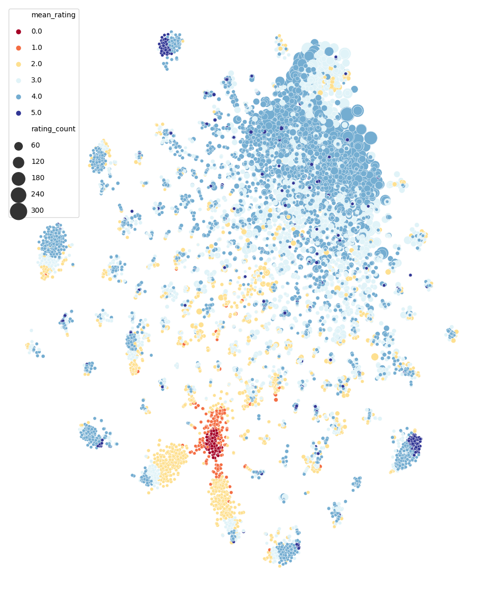

# Recommendation Systems

Nowadays the quantity of information generated easily surpasses our capacity to absorb it, this leads to a problem of knowing which information is relevant or not to be consumed. Therefore, recommendation systems play an important role in filtering information before any user can consume it, whether by recommending movies to be watched or filtering research on Google. In this project we will construct two movies recommendation systems based on the concept of collaborative filtering, i.e., we will group similar users based on their preferences and then recommend movies. To do so, we will use two different algorithms Nearest Neighbor (NN) and Matrix Factorization.

## Relevant results and comments about the algorithms

As can be seen above, the NN algorithm can make good recommendations based on a movie already watched by a user:

Because user 561 watched Toy Story (1995), we recommended: 
- Bug's Life, A (1998)
- Monsters, Inc. (2001)
- Antz (1998)
- Emperor's New Groove, The (2000)
- Shrek the Third (2007)
- Adventures of Rocky and Bullwinkle, The (2000)
- Toy Story 3 (2010)
- Shrek (2001)
- Inside Out (2015)

However, the naive algorithms implemented here are biased, given too much importance to recommending popular movies. It is common for popular movies, such as Forest Gump or Marvel's, to be rated more often. This tendency can be seen in the image below, where we used a t-SNE algorithm to project the Matrix Factorization movie embedding in two dimensions. Notice that we can see two separations, the first one is related to movie ratings, the cluster in red is composed of low-rated movies while the cluster in blue is composed of high-rated movies, the second one is based on popularity, there is a huge cluster on the top of the image with big circles, bigger circles mean more popular movies. These biases can be removed using a more complex model.

|:--:| 
| *t-SNE from the embedding matrix used in the Factorization Matrix method.* |
Notice that there are two clusters, one separating highly rated movies (points in blue) from the lowest rated movies (points in red) and one separating movies that were rated more often (big circles) from the others (small circles).
